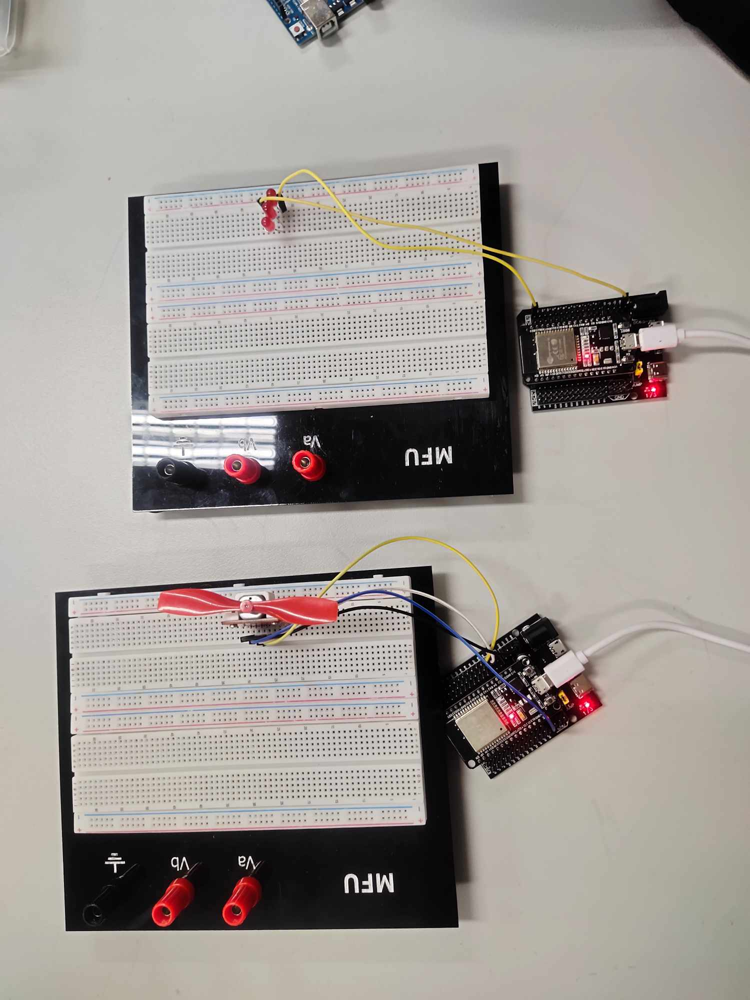

# 🌐 IoT Cloud Control System — LED & Fan using HiveMQ Cloud

This project demonstrates controlling **ESP32 IoT devices** (LED and Fan) via **MQTT** messages sent from a **Node.js + Express** web server.  
It uses **HiveMQ Cloud** as the MQTT broker and provides a **simple web interface** for sending control commands.

---

## 📁 Project Structure

```

📦 MQTT-IoT-Controller
┣ 📂 Subscriber
┃ ┣ 📜 imageESP32.jpg              # Optional image of ESP32 setup
┃ ┣ 📜 subFan.cpp                  # ESP32 fan control subscriber
┃ ┣ 📜 subLed.cpp                  # ESP32 LED control subscriber
┣ 📜 app.js                        # Express.js server + MQTT publisher
┣ 📜 button.html                   # Web UI for controlling LED/Fan
┣ 📜 testToBeSubscriberTopic.js    # Test script for MQTT topic simulation
┣ 📜 README.md                     # Project documentation

```

---

## 🧠 Concept Overview

This IoT system uses a **Publisher-Subscriber** model with **HiveMQ Cloud** as the broker.

```

Web Browser (button.html)
↓
Express.js Server (Publisher)
↓
HiveMQ Cloud (MQTT Broker)
↓
ESP32 Devices (Subscribers)
┣► subLed.cpp → Controls LED
┗► subFan.cpp → Controls Fan

````

---

## 🚀 Quick Start Guide

### 1️⃣ Clone the Repository
```bash
git clone https://github.com/Chaloemsak1010/IoT_LED_Fan_Control.git
cd MQTT-IoT-Controller
````

### 2️⃣ Install Dependencies

```bash
npm install express mqtt
```

---

## ⚙️ Configuration

### 🔑 HiveMQ Cloud Setup

1. Create an account at [HiveMQ Cloud](https://www.hivemq.com/mqtt-cloud-broker/).
2. Create a new cluster and get:

   * Host URL
   * Username
   * Password
3. Replace them in your **`app.js`** file:

```js
const mqttOptions = {
  host: "YOUR_HIVEMQ_URL.s1.eu.hivemq.cloud",
  port: 8883,
  protocol: "mqtts",
  username: "YOUR_USERNAME",
  password: "YOUR_PASSWORD",
};
```

### 🌐 ESP32 Wi-Fi Setup

Edit these lines in **`subLed.cpp`** and **`subFan.cpp`**:

```cpp
const char *ssid = "YOUR_WIFI_NAME";
const char *password = "YOUR_WIFI_PASSWORD";
```

---

## 🖥️ Run the Web Server

### Start Express Server

```bash
node app.js
```

You should see output like:

```
Server is running on port 3000
Connected to MQTT broker
Author : Chaloemsak Arsung
//////////////////////////////////////////////////////////////////
// ======================= Dev: Mike016 ======================= //
//////////////////////////////////////////////////////////////////
```

---

## 🌍 Access the Web Interface

Open your browser and visit:

```
http://localhost:3000/home
```

You’ll see two buttons:

* 💡 **Button for LED**
* 🌬️ **Button for Fan**

Each button toggles its respective topic (`led` or `fan`) between `"true"` and `"false"`.
These messages are published to HiveMQ and received by your ESP32 boards.

---

## 🤖 ESP32 Subscribers

### 1. LED Controller (`Subscriber/subLed.cpp`)

* Subscribes to topic: `led`
* Controls a LED on GPIO **23**
* Turns **ON** or **OFF** based on MQTT message

### 2. Fan Controller (`Subscriber/subFan.cpp`)

* Subscribes to topic: `fan`
* Uses **L9110 motor driver** connected to GPIO **4** and **2**
* Spins or stops the fan depending on message value

Both sketches use **TLS (port 8883)** and **PubSubClient** for MQTT.

---

## 🧪 Testing the MQTT Topics

You can simulate MQTT topic publishing with:

```bash
node testToBeSubscriberTopic.js
```

This script helps test your HiveMQ topics without using the web UI.

---

## 🔒 Security Notes

* The ESP32 code uses:

  ```cpp
  espClient.setInsecure();
  ```

  This **disables SSL certificate validation** — safe for testing, but not for production.
* For deployment, use **valid SSL certificates** and **environment variables** (`.env`) for credentials.

---

## 🏗️ Future Enhancements

* 🔁 Add bidirectional communication (ESP32 → Server → UI)
* 🌡️ Integrate temperature/humidity sensors
* 🧩 Build a dashboard showing real-time device status
* ☁️ Deploy server on **Vercel**, **Render**, or **Railway**

---

## 👨‍💻 Author

**Chaloemsak Arsung**
💼 Developer alias: **Mike016**
📍 Mae Fah Luang University
📧 *(Add email or GitHub link if desired)*

---

## 📸 ESP32 Setup Example



---

### 🏁 Summary

✅ Web app → Publishes MQTT message
✅ HiveMQ Cloud → Routes the message
✅ ESP32 → Subscribes & performs action (LED or Fan ON/OFF)

**IoT made simple — from browser to hardware.**

---

**Made with ❤️ by Chaloemsak Arsung (Mike016)**
“Turning ideas into connected IoT systems.”

---


